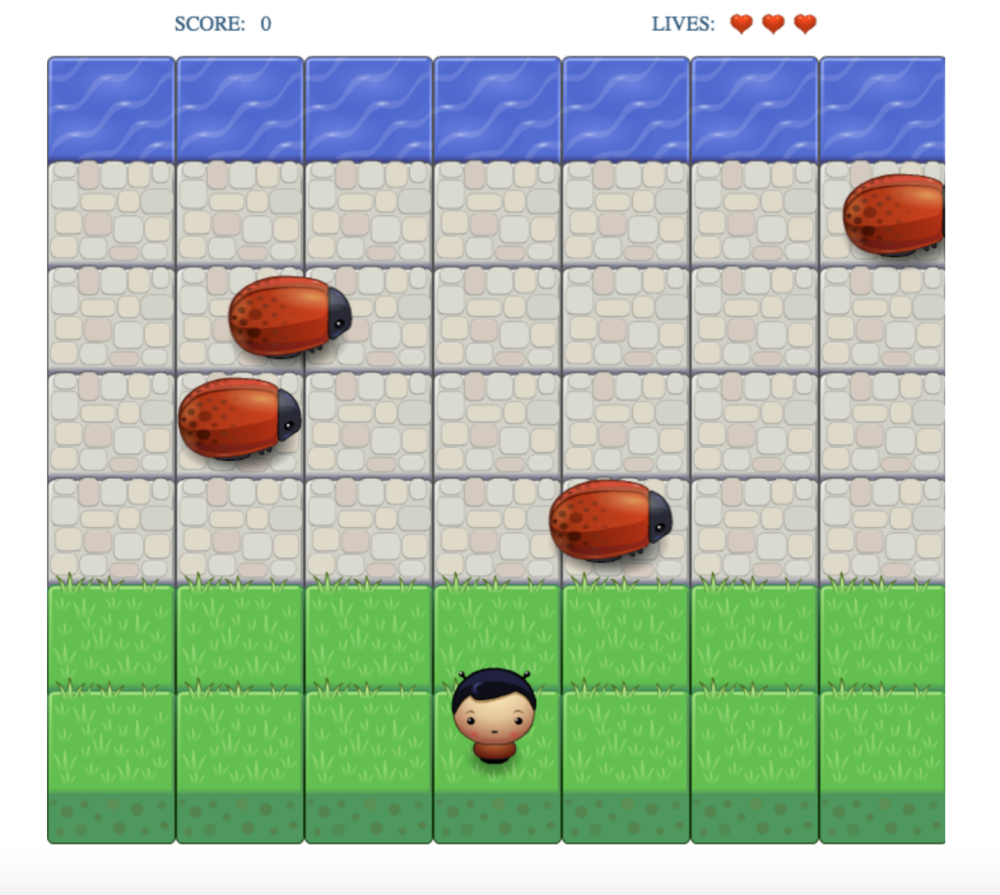
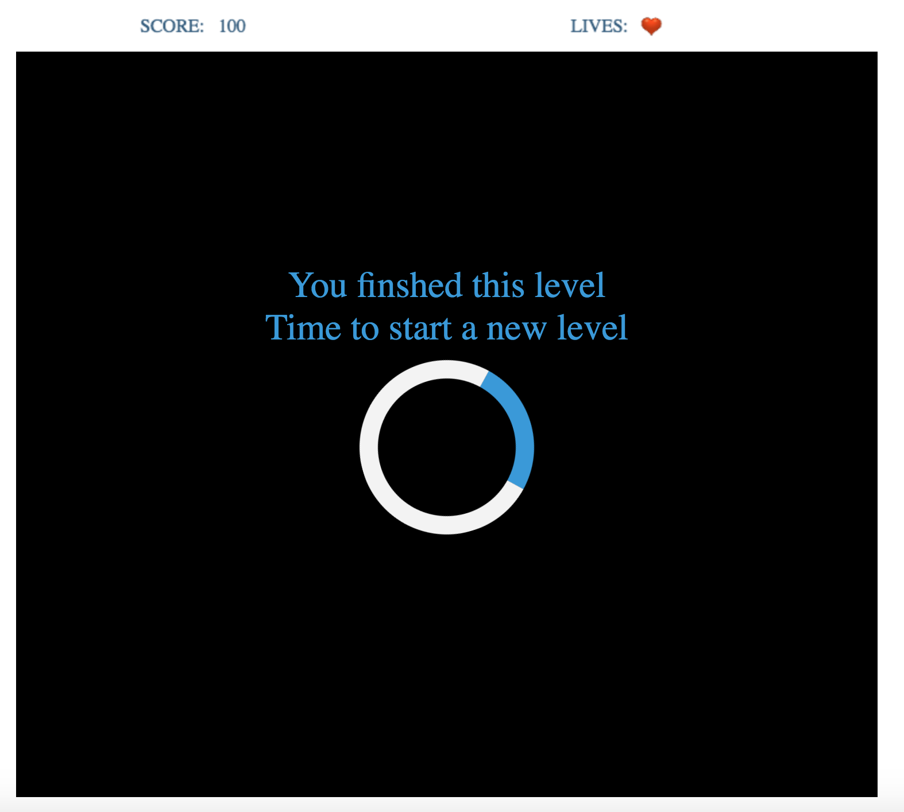
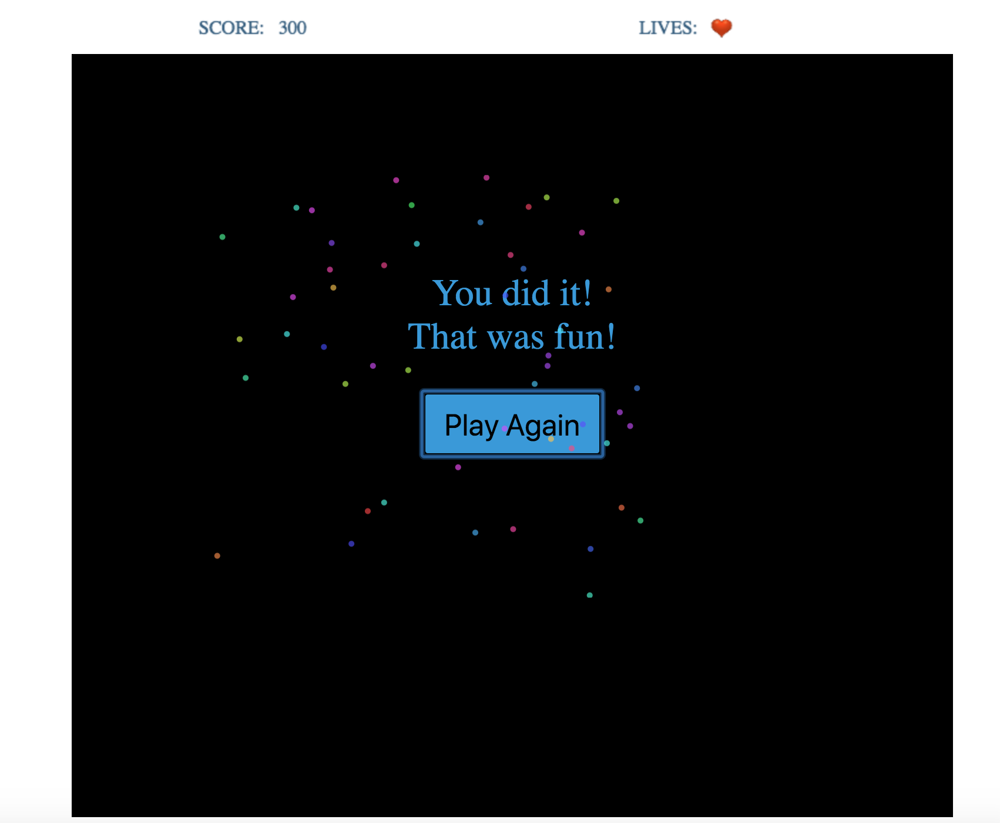
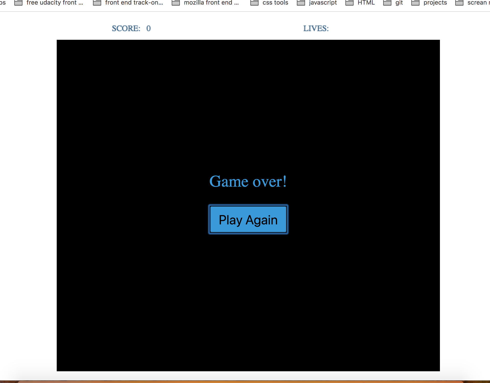

# Classic Arcade Game Clone
## Overview
This game has been made using Canvas and Vanilla JS (no frameworks have been used).
This is the third project for my Udacity frontend Nanodegree Program.
Udacity provided us with visual assets and a resources.js file and a game loop engine.js file witch I made a ninor changes to it add heart image to Resources.load() function.
My task was working on the app.js file and use OOP concepts and features to add a number of entities to the game including the player characters and enemies to recreate the classic arcade game Frogger.
I made the game include score and player lives and the game has three levels each one is depending on your score.

## How To Run The Game
These game don't need you to setup anything in your computer all you need to do are
-- Clone the repository to your local machine or download the project
-- Open the index.html file in your browser and engjoy
Or you can <a href="">Play the game online</a>

## Games Rules?
-- Lead your hero to the water area without colliding with the enemies (bugs).
-- The player starts with 3 lives. If the player hits the enemies, the hero  loses 1 life and will be transported back to the starting point till he loose all of three lives the game will over.
-- If the player reaches the water safely, 100 points will be added to the his score.
-- The player wins when his score reaches 300.
## How to play
-- If you are right handed you can use the arrow keys,
    -- UP arrow moves the player up.
    -- LEFT arrow moves the player left.
    -- DOWN arrow moves the player down.
    -- RIGHT arrow moves the player right.
-- If you are left handed you can yous these alternative keys,
    -- W key moves the player up.
    -- A key moves the player left.
    -- S key moves the player down.
    -- D key moves the player right.